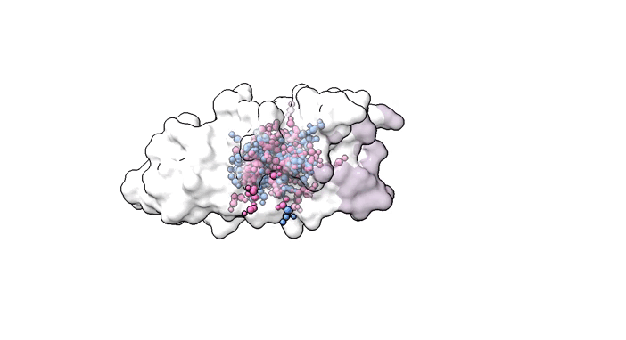

<div align="center">

# IgGM: A Generative Model for Functional Antibody and Nanobody Design


[](https://www.biorxiv.org/content/10.1101/2024.09.19.613838)
[](https://openreview.net/forum?id=zmmfsJpYcq)
[](https://iggm.rubo.wang)



</div>


--------------------------------------------------------------------------------

[English](./README.md) | 简体中文

## 简介
ICLR 2025 的论文 "IgGM: A Generative Model for Functional Antibody and Nanobody Design"的官方实现，可以根据给定的框架区序列设计整体结构，以及 CDR 区序列的工具，同时能够针对特定表位设计相应的抗体。

我们还提供：

论文中构建的测试集包括自2023年下半年以来发布的最新抗原-抗体复合物，并进行了严格的去重处理。

任何公开使用此源代码或模型参数得出的发现的出版物都应引用IgGM论文。

请参阅补充信息以获取方法的详细描述。

如果您有任何问题，请联系IgGM团队，邮箱为 wangrubo@hotmail.com, fandiwu@tencent.com。

商业合作，请联系商务团队，邮箱为 leslielwang@tencent.com。

## 总览


### 主要结果(UTDAntibody)

|      **Model**      | **AAR-CDR-H3** | **RMSD-CDR-H3** | **DockQ** |
|:-------------------:|:--------------:|:---------------:|:---------:|
|   DiffAb(IgFold)    |     0.214      |      2.358      |   0.022   |
| DiffAb(AlphaFold 3) |     0.226      |      2.300      |   0.208   |
|    MEAN(IgFold)     |     0.248      |      2.741      |   0.022   |
|  MEAN(AlphaFold 3)  |     0.246      |      2.646      |   0.207   |
|       dyMEAN        |     0.294      |      2.454      |   0.079   |
|     **IgGM**      |     0.360      |      2.131      |   0.246   |


## 开始

###
1. Clone the package
```shell
git clone https://github.com/TencentAI4S/IgGM.git
cd IgGM
```

2. 安装环境

```shell
conda env create -n IgGM -f environment.yaml
conda activate IgGM
pip install pyg_lib torch_scatter torch_sparse torch_cluster torch_spline_conv -f https://data.pyg.org/whl/torch-2.0.1+cu117.html
```
**可选:** 

如果您需要使用relax输出，请安装以下版本的PyRosetta：

```shell
pip install https://graylab.jhu.edu/download/PyRosetta4/archive/release/PyRosetta4.Debug.python310.linux.wheel/pyrosetta-2024.39+release.59628fb-cp310-cp310-linux_x86_64.whl
```

3. 下载模型(可选，当运行代码时，预训练权重将自动下载)
    * [Zenodo](https://zenodo.org/records/13337550)


**注意**：

如果您将权重下载到文件夹“./checkpoints”中，你可以直接运行后续的代码。

如果您不下载权重，则运行代码时将自动下载权重。

## 数据集
###

Test set we construct in our paper

  * [Zenodo](https://zenodo.org/records/13337550/files/IgGM_Test_set.tar.gz?download=1) (download from zenodo)


该文件夹包含与数据集相关的文件。
- SAb-23-H2-Ab
  - **prot_ids.txt**: 包含蛋白质id的文本文件。
  - **fasta.files.native**: 原始的fasta文件（H 代表重链，L 代表轻链，A 代表抗原，分别跟id里后面的三个字母对应）。
  - **pdb.files.native**: 原始的pdb结构文件（H 代表重链，L 代表轻链，A 代表抗原，分别跟id里后面的三个字母对应）。
  - **fasta.files.design**: 包含被mask的CDR区域fasta文件，其中X代表mask。

- SAb-23-H2-Nano
  - **prot_ids.txt**: 包含蛋白质id的文本文件。
  - **fasta.files.native**: 原始的fasta文件（H 代表抗体，NA代表不存在，A 代表抗原，分别跟id里后面的三个字母对应）。
  - **pdb.files.native**: 原始的pdb结构文件（H 代表抗体，NA代表不存在，A 代表抗原，分别跟id里后面的三个字母对应）。
  - **fasta.files.design**: 包含被mask的CDR区域fasta文件，其中X代表mask。
## 测试样例

你可以使用fasta文件作为序列的输入，pdb文件作为抗原的输入，示例文件位于examples文件夹中。

* **可选：**
  * 所有命令您可以使用Pyrosetta通过添加"--relax"或"-r" 来relax输出。
  * 所有命令您可以通过添加"--max_antigen_size"或''-mas''来指定抗原的最大长度，以避免内存避免内存。

为了方便后续处理，你需要准备一个fasta文件和一个pdb文件，你的fasta文件应该具有以下的结构，具体可以参考examples文件夹。

```
>H  # 重链ID
VQLVESGGGLVQPGGSLRLSCAASXXXXXXXYMNWVRQAPGKGLEWVSVVXXXXXTFYTDSVKGRFTISRDNSKNTLYLQMNSLRAEDTAVYYCARXXXXXXXXXXXXXXWGQGTMVTVSS
>L # 轻链ID
DIQMTQSPSSLSASVGDRVSITCXXXXXXXXXXXWYQQKPGKAPKLLISXXXXXXXGVPSRFSGSGSGTDFTLTITSLQPEDFATYYCXXXXXXXXXXXFGGGTKVEIK
>A # 抗原ID, 需要跟pdb文件保持一致
NLCPFDEVFNATRFASVYAWNRKRISNCVADYSVLYNFAPFFAFKCYGVSPTKLNDLCFTNVYADSFVIRGNEVSQIAPGQTGNIADYNYKLPDDFTGCVIAWNSNKLDSKVGGNYNYRYRLFRKSNLKPFERDISTEIYQAGNKPCNGVAGVNCYFPLQSYGFRPTYGVGHQPYRVVVLSFELLHAPATVCGP
```
* 'X'表示需要设计的区域
* 如果需要获得抗原的表位，可以使用以下命令

```
python design.py --fasta examples/fasta.files.native/8iv5_A_B_G.fasta --antigen examples/pdb.files.native/8iv5_A_B_G.pdb --cal_epitope

antigen表示已知复合物的结构，fasta表示已知复合物的序列，会返回后续需要的epitope格式，复制之后即可将fasta替换成你需要设计的序列进行设计
```

#### 示例一：使用IgGM预测抗体结构和纳米抗体结构
* 如果PDB中有复合物的结构，该命令将自动生成表位信息，这种情况下可以删除（--epitope）。
```
# antibody
python design.py --fasta examples/fasta.files.native/8iv5_A_B_G.fasta --antigen examples/pdb.files.native/8iv5_A_B_G.pdb --epitope 126 127 129 145 146 147 148 149 150 155 156 157 158 160 161 162 163 164

# nanobody
python design.py --fasta examples/fasta.files.native/8q94_C_NA_A.fasta --antigen examples/pdb.files.native/8q94_C_NA_A.pdb --epitope 41 42 43 44 45 46 49 50 70 71 73 74
```

#### 示例二：使用IgGM设计针对给定抗原的抗体和纳米抗体CDR H3环的序列，并预测整体结构。
```
# antibody
python design.py --fasta examples/fasta.files.design/8hpu_M_N_A/8hpu_M_N_A_CDR_H3.fasta --antigen examples/pdb.files.native/8hpu_M_N_A.pdb

# nanobody
python design.py --fasta examples/fasta.files.design/8q95_B_NA_A/C8q95_B_NA_A_DR_3.fasta --antigen examples/pdb.files.native/8q95_B_NA_A.pdb

```

#### 示例三: 使用 IgGM 设计针对给定抗原的抗体和纳米抗体 CDR 环序列，并预测整体结构。
```
# antibody
python design.py --fasta examples/fasta.files.design/8hpu_M_N_A/8hpu_M_N_A_CDR_All.fasta --antigen examples/pdb.files.native/8hpu_M_N_A.pdb

# nanobody
python design.py --fasta examples/fasta.files.design/8q95_B_NA_A/8q95_B_NA_A_CDR_All.fasta --antigen examples/pdb.files.native/8q95_B_NA_A.pdb
```

可以指定其他区域进行设计；可以在示例文件夹中探索更多示例。

#### 示例四: 无需提供复合物的结构信息，仅仅基于给定抗原和结合表位设计抗体和纳米体CDR环序列，预测整体结构。
* **可以针对一个全新的表位进行抗体的设计**
```
# antibody
python design.py --fasta examples/fasta.files.design/8hpu_M_N_A/8hpu_M_N_A_CDR_All.fasta --antigen examples/pdb.files.native/8hpu_M_N_A.pdb --epitope 126 127 129 145 146 147 148 149 150 155 156 157 158 160 161 162 163 164

# nanobody
python design.py --fasta examples/fasta.files.design/8q95_B_NA_A/8q95_B_NA_A_CDR_All.fasta --antigen examples/pdb.files.native/8q95_B_NA_A.pdb --epitope 41 42 43 44 45 46 49 50 70 71 73 74
```
对于全新的抗原，您可以指定表位来设计可以与这些表位结合的抗体。

#### 示例五: 合并多条抗原链到一条链，需要指定合并的链的id。

```
python scripts/merge_chains.py --antigen examples/pdb.files.native/8ucd.pdb --output ./outputs --merge_ids A_B_C
```

## Citing IgGM

如果你在研究中使用了IgGM, 请引用我们的工作

```BibTeX
@inproceedings{
wang2025iggm,
title={Ig{GM}: A Generative Model for Functional Antibody and Nanobody Design},
author={Wang, Rubo and Wu, Fandi and Gao, Xingyu and Wu, Jiaxiang and Zhao, Peilin and Yao, Jianhua},
booktitle={The Thirteenth International Conference on Learning Representations},
year={2025},
url={https://openreview.net/forum?id=zmmfsJpYcq}
}

```
